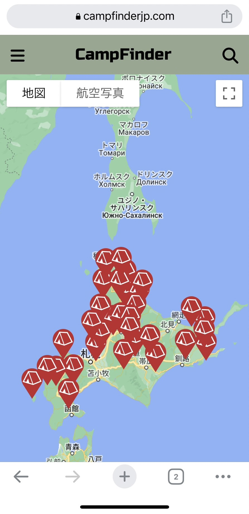
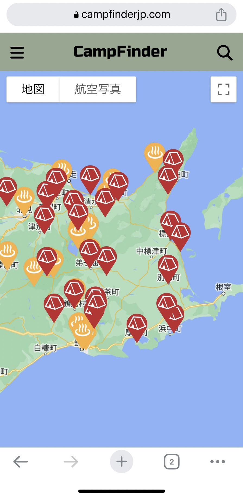
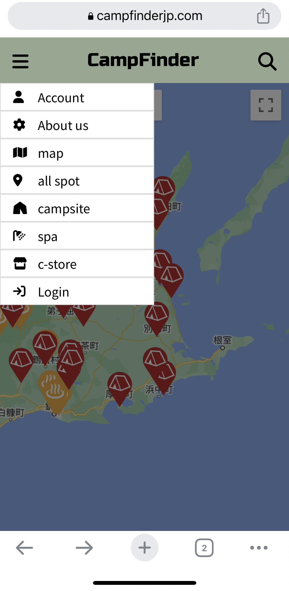
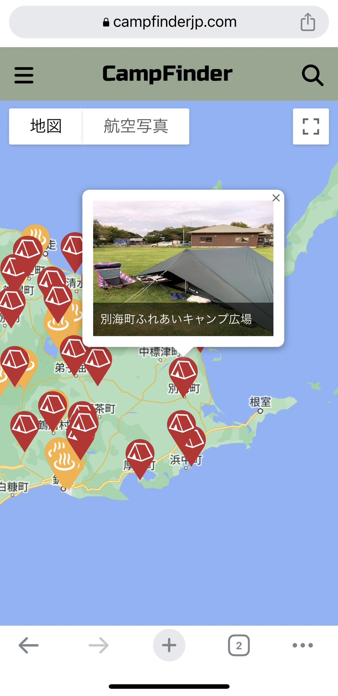
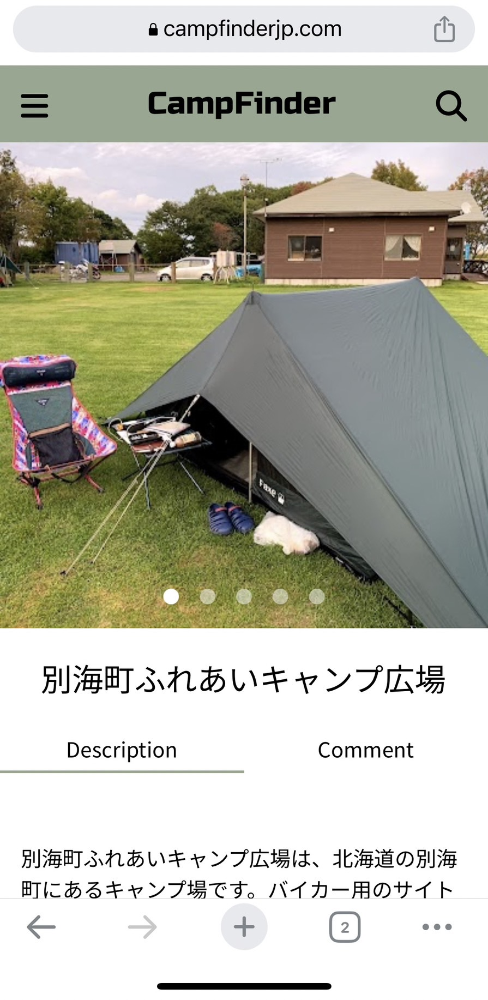
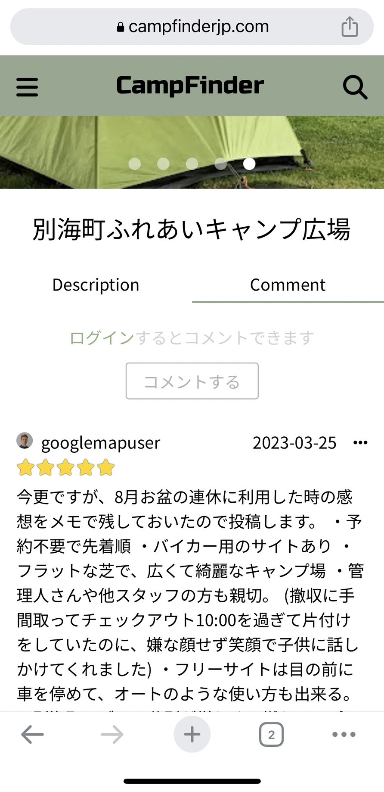
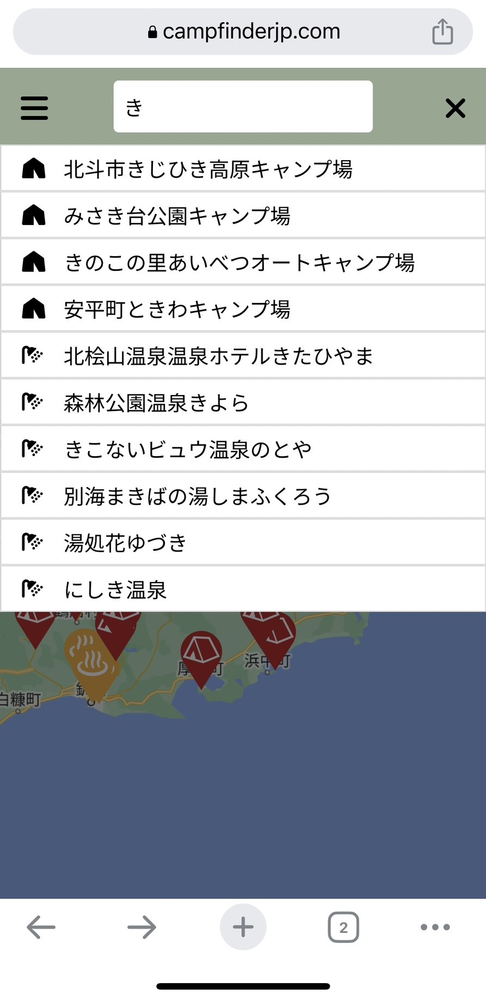

# CampsiteFinder
## 公開日
2023年3月29日

https://campfinderjp.com/

## 開発動機
北海道をその日任せで自転車旅行している時に、最寄りのキャンプ場・温泉・コンビニの情報を求めたのですが、検索が煩雑な上に情報の内容も鮮度も劣り、苦労しました。自転車仲間も同じ不便さを嘆いていたことから、これを解決できるサイトを作ろうと思いました。

## サイトの特徴
「CampFinder」はGoogle map上にキャンプ場・温泉・コンビニのアイコンが並び、これをタッチすると画像が現れ、さらに詳細情報（住所、電話番号、営業期間、入場料など）が表示されます。また、サイドバーからスポットの絞り込みができ、キャンプ場、温泉、コンビニの個別表示も可能です。これにより、最寄りのスポットを検索する際の煩雑さを解消することができます。

特に、特徴的なのが各施設の” Description”の表記で、ChatGPT のAPIを用いて、数個から数十個あるGoogle 評価コメントを”Chat GPT” に読み込ませ、要約させている点。これにより情報の客観性と鮮度を自動的に得ています。要約時には悪意ある評価や過大な広告的な書き込みは無視されるよう ”Chat GPT” に指示しています。

## サイトの使い方
- デフォルトでいくつかのキャンプ場が表示されており、zoomすることにより表示される数が増えます。また、サイドバーから表示するスポットを絞り込めます。

　　

 

- スポットのiconをクリックすることで、情報ウィンドウが出現し、もう一度クリックすると詳細画面に飛びます
 
　　　　

 

- コメント機能、検索機能も実装しています。

　　　　
