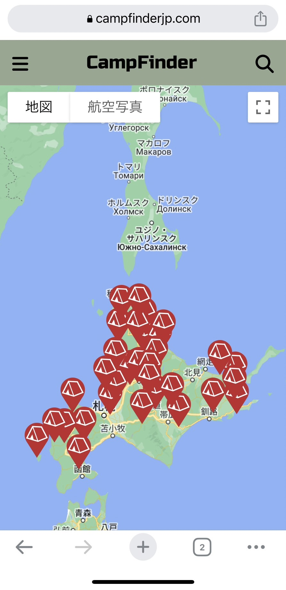
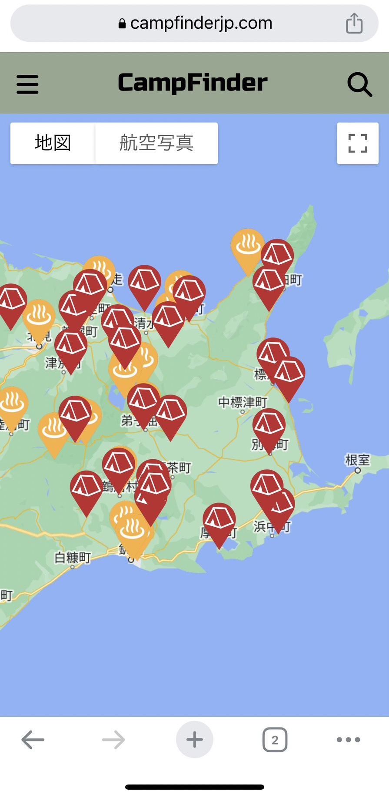
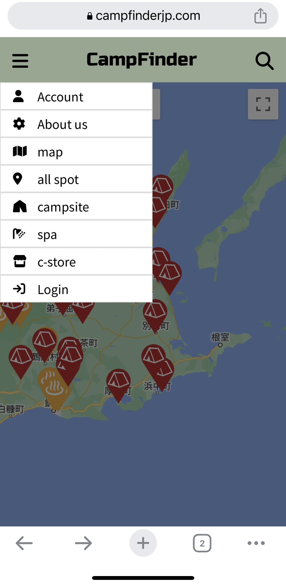
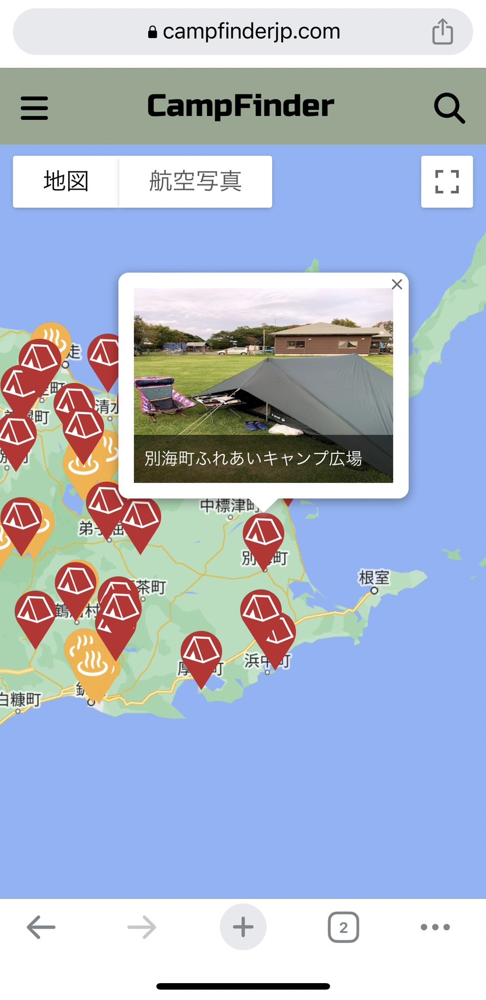
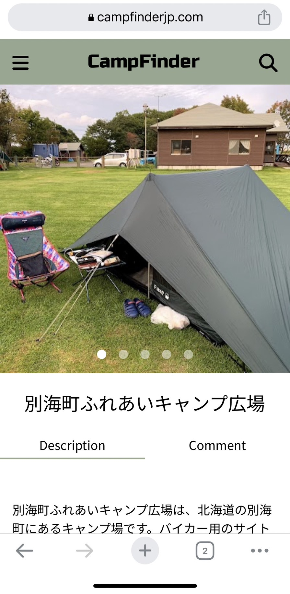
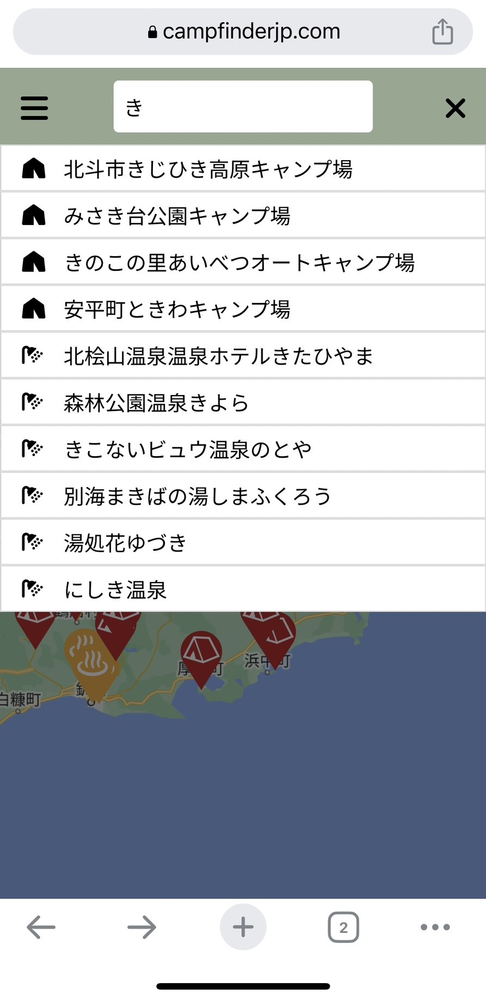

# CampFinder
## 公開日
2023年3月29日

https://campfinderjp.com/

## 開発動機
北海道をその日任せで自転車旅行している時に、最寄りのキャンプ場・温泉・コンビニの情報を求めたのですが、検索が煩雑な上に情報の内容も鮮度も劣り、苦労しました。自転車仲間も同じ不便さを嘆いていたことから、これを解決できるサイトを作ろうと思いました。

## サイトの特徴
「CampFinder」はGoogle map上にキャンプ場・温泉・コンビニのアイコンが並び、これをタッチすると画像が現れ、さらに詳細情報（住所、電話番号、営業期間、入場料など）が表示されます。また、サイドバーからスポットの絞り込みができ、キャンプ場、温泉、コンビニの個別表示も可能です。これにより、最寄りのスポットを検索する際の煩雑さを解消することができます。

特に、特徴的なのが各施設の” Description”の表記で、ChatGPT のAPIを用いて、数個から数十個あるGoogle 評価コメントを”Chat GPT” に読み込ませ、要約させている点。これにより情報の客観性と鮮度を自動的に得ています。要約時には悪意ある評価や過大な広告的な書き込みは無視されるよう ”Chat GPT” に指示しています。

## サイトの使い方
- デフォルトでいくつかのキャンプ場が表示されており、zoomすることにより表示される数が増えます。また、サイドバーから表示するスポットを絞り込めます。

　　

 

- スポットのiconをクリックすることで、情報ウィンドウが出現し、もう一度クリックすると詳細画面に飛びます
 
　　　　

 

- コメント機能、検索機能も実装しています。

　　　　

## 制作環境（サーバー環境や使用ツール）と使用言語
- フロントエンド言語 (HTML,CSS,JavaScript)
- バックエンド言語 (Python)
- フレームワーク (Django)
- データベース (PostgreSQL)
- webサーバー (Nginx)
- クラウドサービス (AWS)

## なぜPythonなのか？
バックエンド言語としてPythonを選んだ理由は二つあります。

①Django REST Frameworkを使用することで、APIを作成してGoogle Mapsとのデータのやり取りを簡単に行えるため。

②将来的に機械学習を利用したサービスを組み込む予定があるため、機械学習のライブラリが豊富なPythonを使えば、機械学習のモデル構築やデータの前処理を容易に行うことができるため。

以上の理由から、Pythonを選択した方が、APIの開発とGoogle Mapsとのデータ連携の効率化や将来的な機械学習の統合において有利であると考えました。

## なぜNginxなのか？
webサーバーとしてNginxを選んだ理由は二つあります。

①CampFinderでは多くの静的コンテンツ(画像)を提供しているため、Nginxをリバースプロキシとして動作させることで、Webアプリケーションのパフォーマンスの向上を図るため。

② Nginxは非同期イベント駆動のアーキテクチャを採用しており、多数の同時接続や高トラフィックの環境でも高いパフォーマンスを発揮するため。

以上の理由から、CampFinderのような静的コンテンツが多いサイトでは、Nginxを選択した方が、静的コンテンツの配信の最適化や高いパフォーマンスが実現できると考えました。

## 工夫した点
- 詳細ページから地図ページに戻ってきた場合、詳細ページへ推移する前の地図の状態で表示されず地図の状態が初期化される問題が発生しました。これは、ユーザーの体験にとってストレスになると考えた為、詳細ページへ推移する前の地図の状態で表示されるように、ブラウザバックやLocal Strageを活用して復元するようにしました。なぜ、ブラウザバックだけでなくLocal Strageも使っているかというと、ブラウザバックはブラウザの環境に依存する為、ブラウザバックが効かない環境ではLocal Strageに保存しておいた以前のマップの状態から復元することにより、ブラウザ環境関係なく地図の状態を復元できるようにしました。

- スポットの情報をLocal Strageにキャッシュしておくことにより、無駄な通信を減らし表示を高速化したり、圏外であってもスポットの情報が表示されるようにしました。
